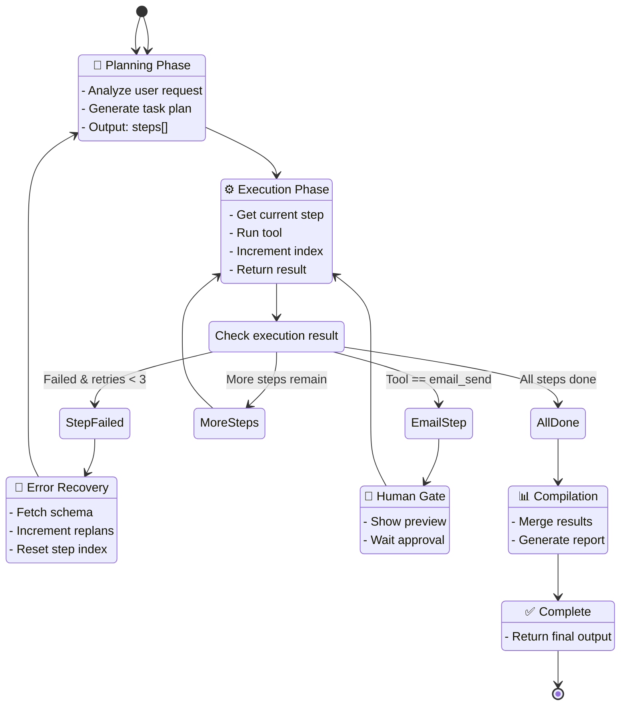
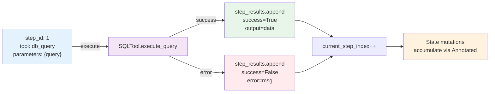
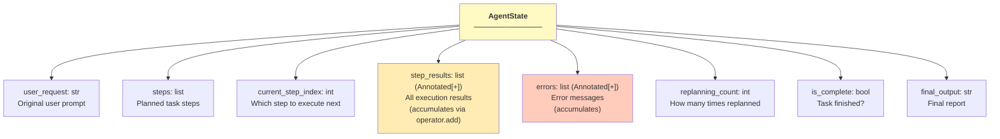
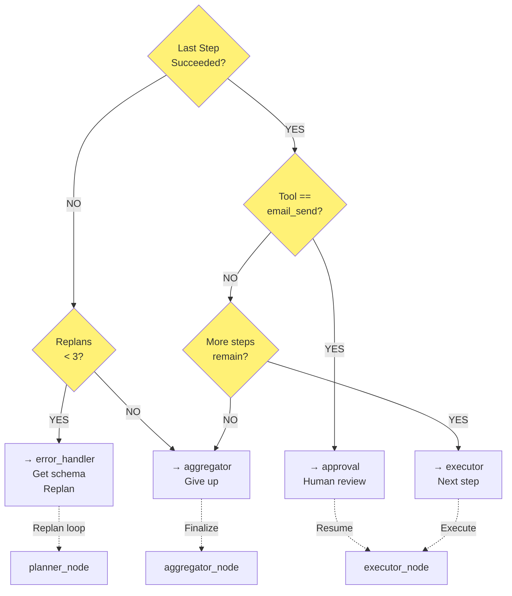
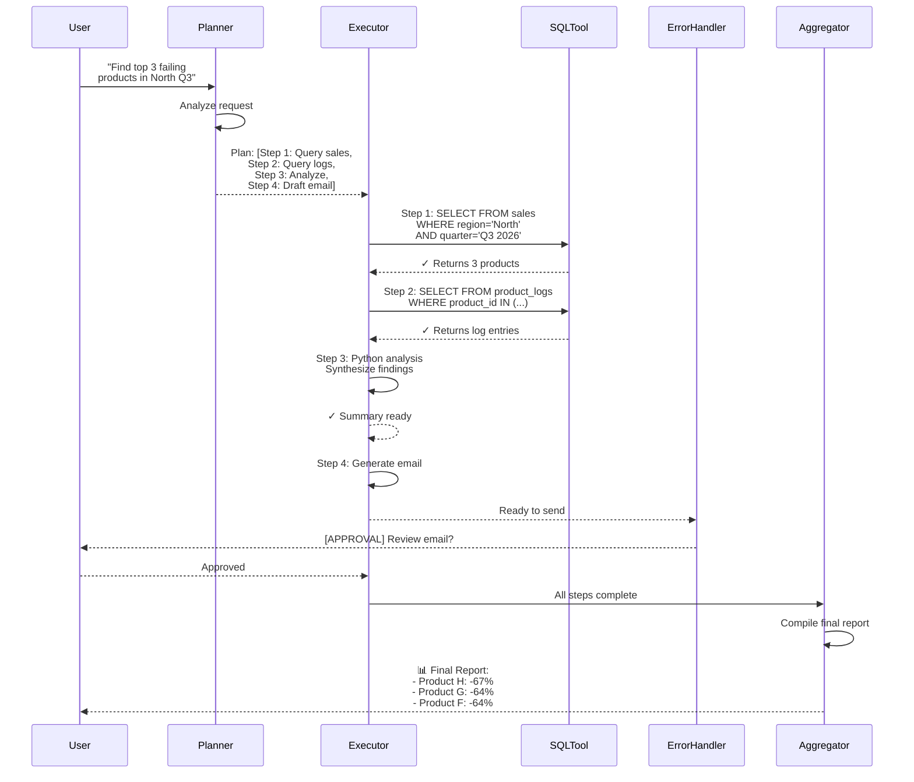

# LangGraph Workflow Diagram

## Agent Execution Flow

```mermaid
graph TD
    START([User Request]) --> PLANNER["<b>PLANNER NODE</b><br/>Decompose request<br/>into task steps"]
    
    PLANNER -->|Output: steps[]| EXECUTOR["<b>EXECUTOR NODE</b><br/>Execute current step<br/>current_step_index++"]
    
    EXECUTOR -->|Check step result| ROUTER{"<b>CONDITIONAL ROUTER</b><br/>Route after execution"}
    
    ROUTER -->|Step failed &<br/>replans < 3| ERROR["<b>ERROR HANDLER</b><br/>Fetch schema context<br/>replans++<br/>reset step index"]
    ERROR -->|Replan with<br/>error context| PLANNER
    
    ROUTER -->|Step is email_send| APPROVAL["<b>APPROVAL NODE</b><br/>Human review<br/>Email preview"]
    APPROVAL -->|Human approves| EXECUTOR
    
    ROUTER -->|More steps<br/>remain| EXECUTOR
    
    ROUTER -->|All steps done| AGGREGATOR["<b>AGGREGATOR NODE</b><br/>Compile results<br/>into final report"]
    
    AGGREGATOR --> END([Final Report])
    
    ROUTER -->|Step failed &<br/>replans >= 3| AGGREGATOR
    
    style START fill:#e1f5ff
    style PLANNER fill:#fff3e0
    style EXECUTOR fill:#f3e5f5
    style ERROR fill:#ffebee
    style APPROVAL fill:#e8f5e9
    style AGGREGATOR fill:#e0f2f1
    style END fill:#c8e6c9
    style ROUTER fill:#fffde7
```

---

## State Machine Diagram



---

## Step Execution Flow (Detailed)



---

## State Schema (Pydantic Model)



---

## Conditional Routing Logic



---

## Example: Agent Processing the Demo Request



---

## Key Concepts

| Concept | Purpose | Example |
|---------|---------|---------|
| **StateGraph** | Define nodes & edges | `graph = StateGraph(AgentState)` |
| **Nodes** | Processing steps | `planner_node()`, `executor_node()` |
| **Edges** | Deterministic transitions | `graph.add_edge("planner", "executor")` |
| **Conditional Edges** | Dynamic routing | `graph.add_conditional_edges("executor", router_fn, {...})` |
| **Annotated[list, add]** | Accumulating state | `step_results` appends, never replaces |
| **Checkpointing** | Resumable execution | Save state → resume later |
| **Interrupt** | Human-in-the-loop | Pause before `email_send` |

